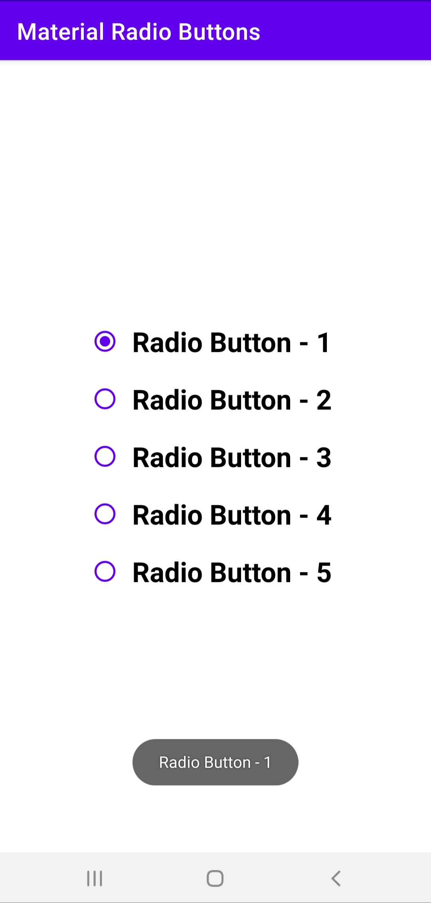
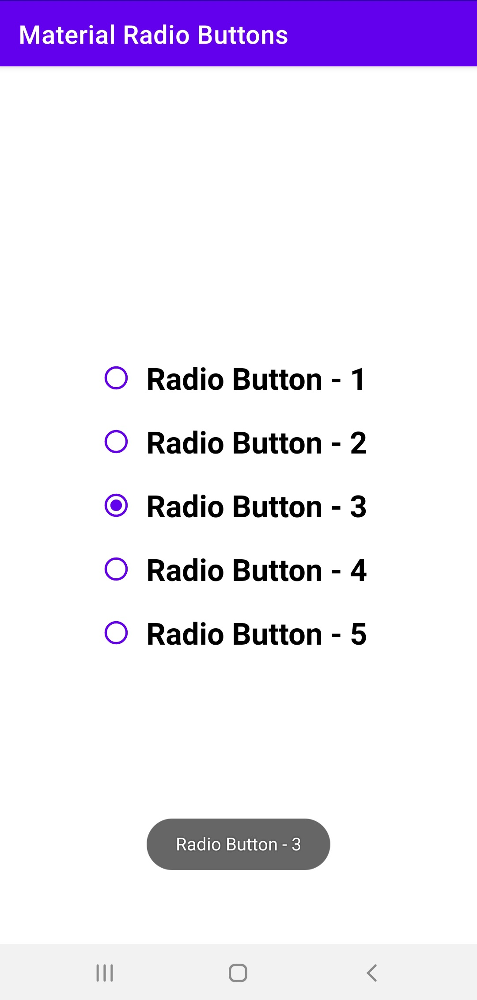
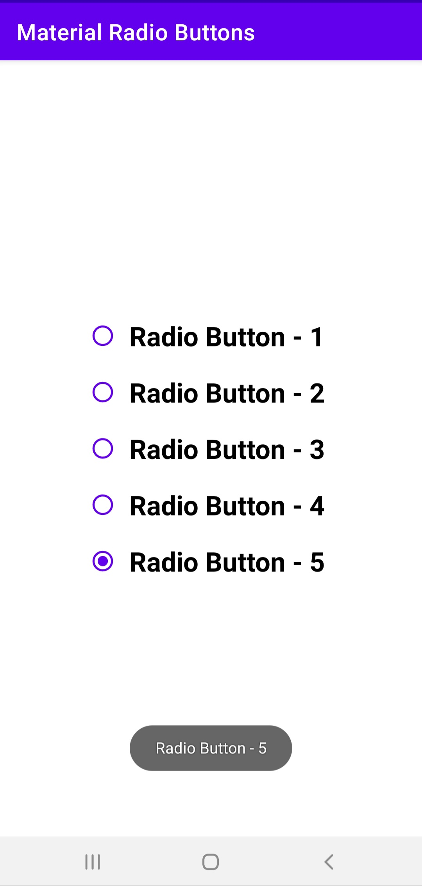

# Material-RadioButton
To work with RadioButton and RadioGroup from Material Design Component

### Screenshots of the App
<table>
  <tr>
    <td>  </td>
    <td>  </td>
    <td>  </td>
  </tr>
</table>
